## Tutorial 3

 Set the network adapter setting in both kali vm and the owasp to the host only network adapter and continue.
Get the ip address of the owasp machine and type it in the kali vm browser.

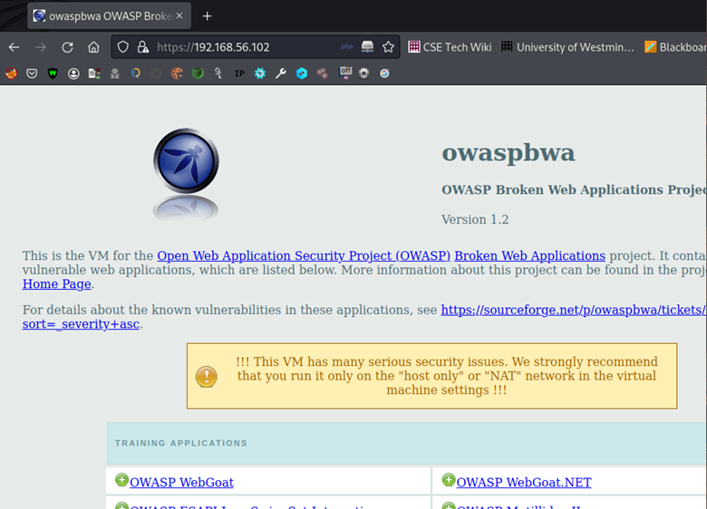

### TheHarvester
Harvester is a tool for searches the information that are already available online. This tool can search information without raising any alarms. This is a passive reconnaissance - an attempt to gain information about targeted computers and networks without actively engaging with the systems.

|Parameter|Definition|
|:----|:----|
|-d|Specify the domain|
|-b|Specify the data source (eg – google, linkedin)|
|-l|This is used for certain sources as they might block if the number of requests is not set.|
|-f|To save the output to a file.|

Example code
 - `theHarvester -d westminster.ac.uk -b google -l 100`

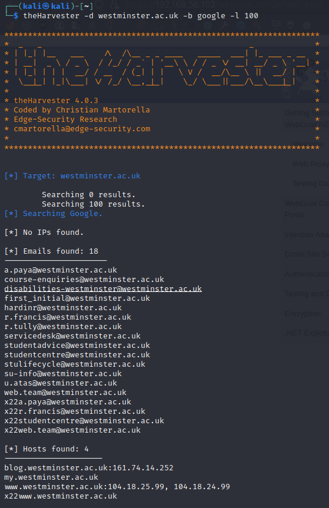

saving to an output file. 
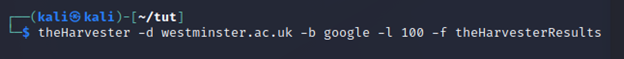
----------

### SpiderFoot
Gathering intelligence about a given target, which may be an IP address, domain name, hostname etc.

1. Running spiderfoot in a port.
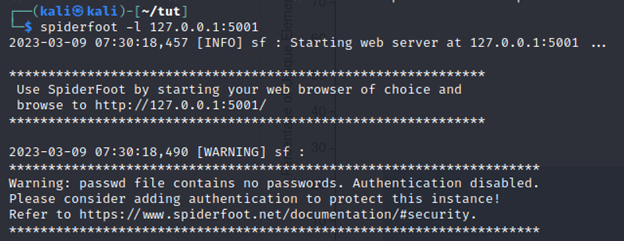

2. Starting a new scan, scanning for the owasp broken vm.
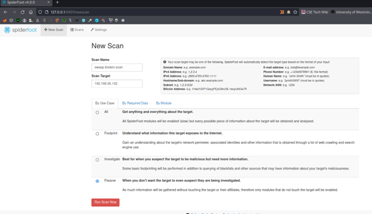

3. Results
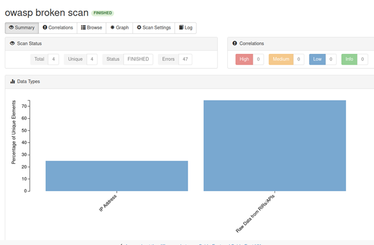
----------

### Recon-ng

Information gathering tool that uses different sources to gather data.

1. Running recon-ng
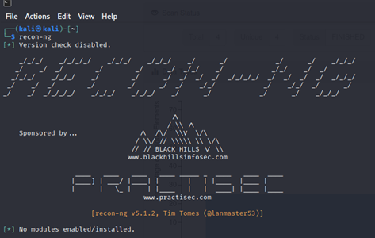

2. Since there are no modules, will install the hackertarget module which will search for sub domains on any given domains.
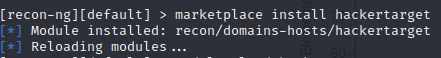

3. Will be gather information about cwscenario.site using hackertarget module.
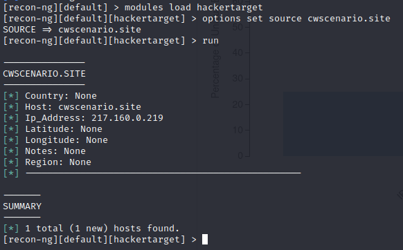

----------

### SIGIT – Simple Information Gathering Toolkit
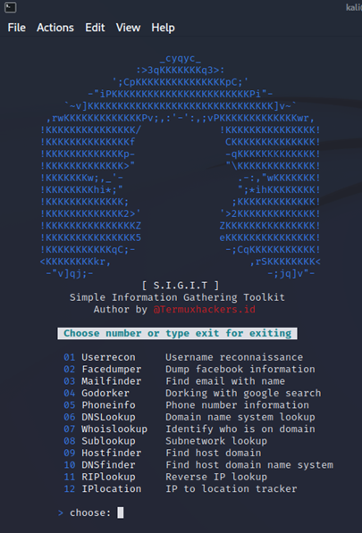

### Information Gathering
Both VMs should be set to host-only adapter.

1. Checking the host is up and server is responding.
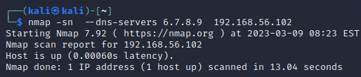

2. Even after setting up the dns server, if the kali vm raise that cannot find a dns server use this alternate command which will use the specified dns server without touching the system configurations.
nmap –dns-servers 6.7.8.9 192.168.56.102

Scanning open ports.

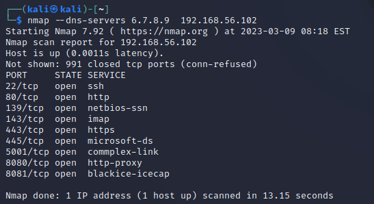

3. Checking the services that are running on the server and guessing the operating system.
sudo nmap  -sV -O 192.168.56.102

    -sV will request for the banner-header for each open ports.
    -O will guess the operating system on the target server based on the collected information from the open ports.

    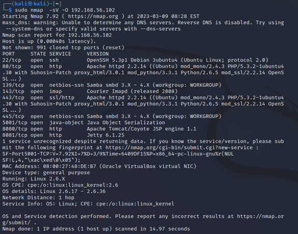

4. Checking if a host is up or not.
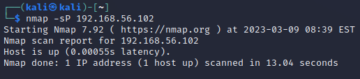

5. Finding open ports with a given range. Here it will scan first 100 ports.
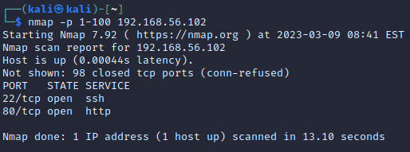

6. Output the result to a specific file in a specified format
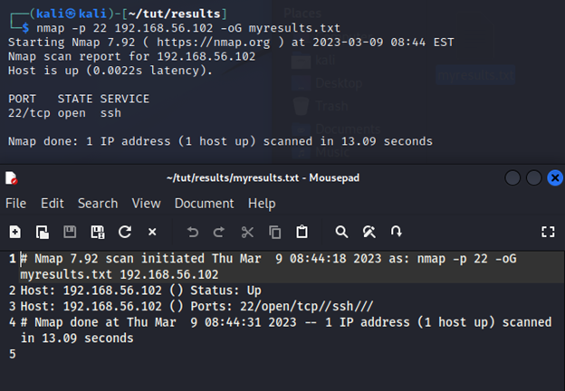

